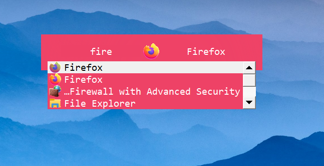

# Launchy Config
## 
#### shortcut: alt + enter
## How to install
```
git clone https://github.com/matthefish/launchy-skin
cd launchy-skin
mv frame.png path/to/new/launchy/skin
mv style.qss path/to/new/launchy/skin
mv spinner.mng path/to/new/launchy/skin
```
The path to your launchy skins will often times be C:\Program Files (x86)\Launchy\skins (it is for me atleast). Once in this directory make a new folder and name it whatever you want (just be sure to include it when moving the required files to make this skin work).


